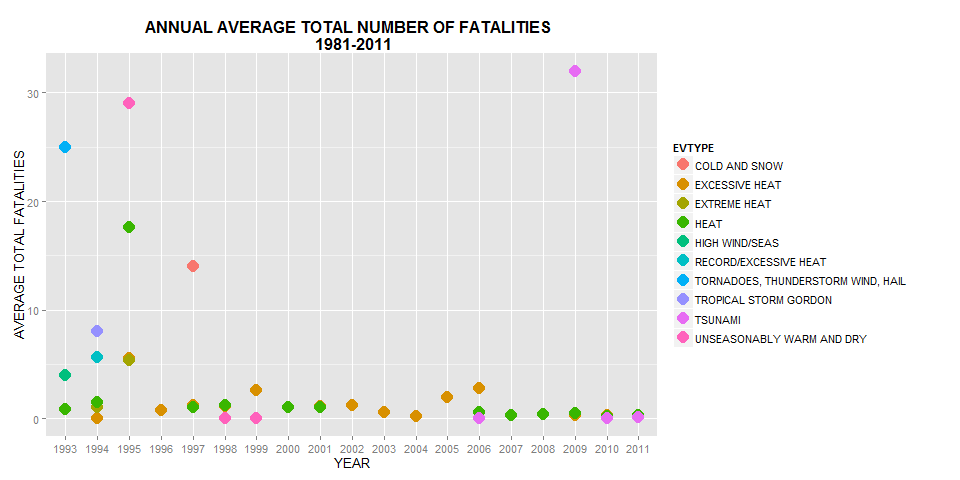
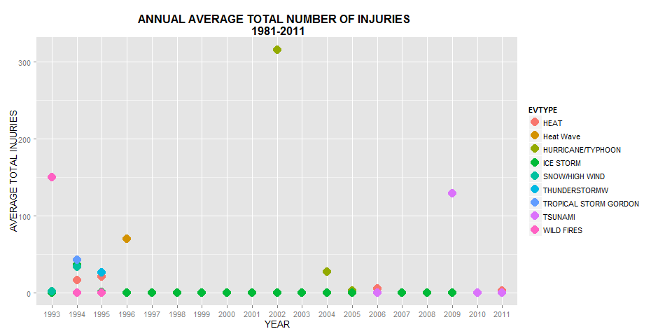
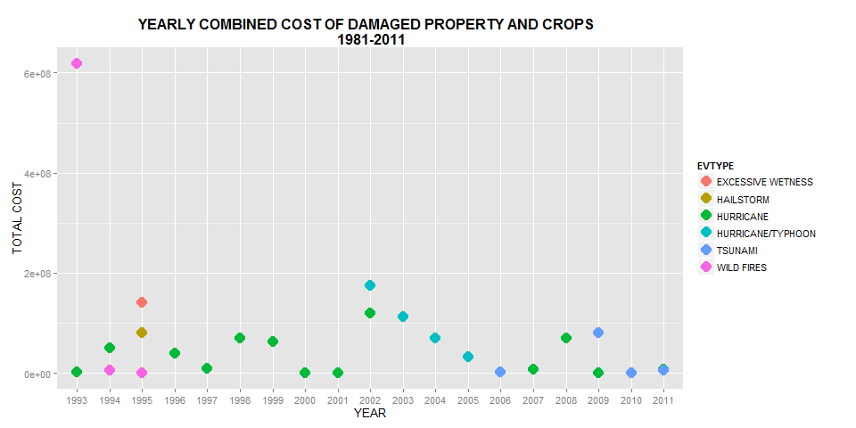

# Economic and Health Consequences of Storm Events and Other Severe Weather Phenomena in the United States of America from 1981 to 2011


## Synopsis

*Severe weather conditions often cause both public health and economic problems throughout the world. In this report we aim to perform an exploratory analysis of recorded severe weather events such as storms and drought across all states in the United States of America (USA) between the years 1981 and 2011. This report highlights the economic and health consequences of such events, in terms of associated total number of fatalities, injuries, and the cost of damaged property and agricultural crops. The analysis is based on data from the National Oceanic and Atmospheric Administration (NOAA), and the results shows that relatively more people are injured in most severe weather conditions than those who are killed. There is also an observed decrease in the numbers after the year 2000 compared to the mid 1990s.A more detailed statistical analysis is beyond the scope of this report, but is recommended in order to synthesis all the available information and possible influence policy and legislation that could help residents of the USA to adequately prepare for the possibility of extreme weather conditions.*


## Data Processing
### Data

The study is based on data provided by the National Oceanic
and Atmospheric Administration (NOAA)  which can be downloaded from the following Uniform Resource Locator(URL): https://d396qusza40orc.cloudfront.net/repdata%2Fdata%2FStormData.csv.bz2 . The original database can also be downloaded from http://www.ncdc.noaa.gov/oa/climate/severeweather/extremes.html .  According to the National Weather Service (NWS) documentation (available from http://www.nws.noaa.gov/directives/), the database documents the occurrence of storms and other significant weather phenomena having sufficient intensity to cause loss of life, injuries, significant property damage, and/or disruption to commerce; In addition, the database documents rare, unusual, weather phenomena that generate media attention,  and other significant meteorological events. The database contains Storm events data from 1950 to November 2011

### Downloading and  reading in the Database
Using R, the data can be dowloaded from the provided URL and read using the following R commnands

```r
# Download zipped file
StormDataZipfile <- "StormData.csv.bz2"
if (!file.exists(StormDataZipfile)) {
    fileUrl <- "https://d396qusza40orc.cloudfront.net/repdata%2Fdata%2FStormData.csv.bz2"
    download.file(fileUrl, destfile = StormDataZipfile, method = "internal")
}

## stop if downloading failed or file 'StormData.csv.bz2' not in working
## directory
if (!file.exists(StormDataZipfile)) {
    stop("Error: StormDataZipfile file is not in the working directory.")
}

## read data from file

StormData <- read.csv(bzfile("StormData.csv.bz2"))

```


### Exploratory Analysis and Subseting the Data
The R commands below shows that the data contains 902297 storm and other severe weather event observations(rows) capturing 37 variables (columns) for each event. The first 3 observations(rows) are displayed below:

```r
dim(StormData)
```

```
## [1] 902297     37
```

```r
head(StormData, 3)
```

```
##   STATE__          BGN_DATE BGN_TIME TIME_ZONE COUNTY COUNTYNAME STATE
## 1       1 4/18/1950 0:00:00     0130       CST     97     MOBILE    AL
## 2       1 4/18/1950 0:00:00     0145       CST      3    BALDWIN    AL
## 3       1 2/20/1951 0:00:00     1600       CST     57    FAYETTE    AL
##    EVTYPE BGN_RANGE BGN_AZI BGN_LOCATI END_DATE END_TIME COUNTY_END
## 1 TORNADO         0                                               0
## 2 TORNADO         0                                               0
## 3 TORNADO         0                                               0
##   COUNTYENDN END_RANGE END_AZI END_LOCATI LENGTH WIDTH F MAG FATALITIES
## 1         NA         0                      14.0   100 3   0          0
## 2         NA         0                       2.0   150 2   0          0
## 3         NA         0                       0.1   123 2   0          0
##   INJURIES PROPDMG PROPDMGEXP CROPDMG CROPDMGEXP WFO STATEOFFIC ZONENAMES
## 1       15    25.0          K       0                                    
## 2        0     2.5          K       0                                    
## 3        2    25.0          K       0                                    
##   LATITUDE LONGITUDE LATITUDE_E LONGITUDE_ REMARKS REFNUM
## 1     3040      8812       3051       8806              1
## 2     3042      8755          0          0              2
## 3     3340      8742          0          0              3
```


From the column names, we observe that the type of event is captured in the EVTYPE variable. The location of the event is also recorded in terms of  the state, county number and county name using state STATE_, STATE, COUNTY, COUNTYNAME variables respectively. The database also records the begining and end (date and time) for each event in several variables.  In addition, the number of  people killed and injured in each event is recorded in the FATALITIES and INJURIES variables respectively. 

The cost associated with damage to property in each event is recorded in the PROPDMG and PROPDMGEXP variables. Similarly, The cost associated with damage to crops is recorded in the CROPDMG and CROPDMGEXP variables. More details about all the 37 variables can be obtained for the NWS documentation (http://www.nws.noaa.gov/directives/).


The number of occurances of each event type captured in the database can be viewed using the summary() command in R. The following R codes shows that there are 985 unique events captured in the dataset. However, it should be noted that some of  some  of the entries on this variable refer to summaries, such as "Summary of March 14 " instead of actual events. Therefore, there is a need to clean-up the data. Shown below are the top 10 most recuring events that are captured in the database.

```r
print(length(unique(as.character(StormData$EVTYPE))))
```

```
## [1] 985
```

```r
print(head(sort(summary(StormData$EVTYPE), decreasing = TRUE), 10))
```

```
##               HAIL          TSTM WIND  THUNDERSTORM WIND 
##             288661             219940              82563 
##            TORNADO        FLASH FLOOD              FLOOD 
##              60652              54277              25326 
## THUNDERSTORM WINDS          HIGH WIND          LIGHTNING 
##              20843              20212              15754 
##         HEAVY SNOW 
##              15708
```


The listing of the events further reveals some data entry error problems. For example, in the above listing "THUNDERSTORM WIND" is sometimes entered as "THUNDERSTORM WINDS" or abbreviated as "TSTM WIND". In other instances "WIND" is entered as "WND", and even "WINS" in others. Therefore the daset will need to be tidied-up.

The following R code confirms that the the data in the database was collected between January, 1950 and November, 2011.


```r
## Convert BNG_DATE to a Date variable, instead of factor of strings
StormData$BGN_DATE <- as.Date(as.character(StormData$BGN_DATE), "%m/%d/%Y %H:%M:%S")
## get minimum and maxmum date
print(c(min(StormData$BGN_DATE), max(StormData$BGN_DATE)))
```

```
## [1] "1950-01-03" "2011-11-30"
```


For the purposes of this study, we shall only consider events that occured in the last 30 years. That is events whose beginnig date is after January, 1981. The following R code subsets the data on the required dates, and displays the number of observations in the subset and a revised summary of the top top 10 most recuring events that are captured in the 30 year period.

```r
from1981Data <- StormData[(StormData$BGN_DATE >= "1981-01-01"), ]
dim(from1981Data)
```

```
## [1] 820785     37
```

```r
percentofOriginal <- sprintf("%.2f", nrow(from1981Data)/nrow(StormData) * 100)
print(percentofOriginal)
```

```
## [1] "90.97"
```

```r
print(head(sort(summary(from1981Data$EVTYPE), decreasing = TRUE), 10))
```

```
##               HAIL          TSTM WIND  THUNDERSTORM WIND 
##             265525             184415              82563 
##        FLASH FLOOD            TORNADO              FLOOD 
##              54277              37801              25326 
## THUNDERSTORM WINDS          HIGH WIND          LIGHTNING 
##              20843              20212              15754 
##         HEAVY SNOW 
##              15708
```


We observe that the subset data from January 1981 to 2011 contains 90.97 % of the obsevations in the original data.


### Cleaning-up and formatting the Data

As noted before some of the data entries in the EVTYPE variable are summaries not actual individual events. So we need to first remove these entries. Secondly the entries where "WIND" is sometimes entered as WND or WINS needs to be resolved. Another example is the case where THUNDERSTORM is sometimes abbreciated as "TSTM". The following R code cleans-up the dataset along these lines. The focus was on the top 10 most recurring events between 1981 and 2011. The actual details of what is being done is provided as comments in the code.


```r
## remove SUMMARY EVENTS
summaryIndex <- grepl("^(Summary)", from1981Data$EVTYPE, ignore.case = TRUE)
from1981Data_1 <- from1981Data[!summaryIndex, ]

## replace WINDSS with WIND in an event type
from1981Data_1$EVTYPE <- sub("WINDSS", "WIND", from1981Data_1$EVTYPE)

## replace WINDS WITH WIND in an event type
from1981Data_1$EVTYPE <- sub("WINDS", "WIND", from1981Data_1$EVTYPE)

## replace TSTM with THUNDERSTORM in an event type
from1981Data_1$EVTYPE <- sub("TSTM WIND", "THUNDERSTORM WIND", from1981Data_1$EVTYPE)
numUniqueEvents <- length(unique(as.character(from1981Data_1$EVTYPE)))
```


The tidying up of the data was only limited to the to 10 most recurring events. Other errors were not attended to due to time constraints.
After the minor clean up, the dataset has 891 unique event types, and a summary of the top 10 most recurring events is shown below:

```r
print(length(unique(as.character(from1981Data_1$EVTYPE))))
```

```
## [1] 891
```

```r
print(head(sort(summary(as.factor(from1981Data_1$EVTYPE)), decreasing = TRUE), 
    10))
```

```
##        THUNDERSTORM WIND                     HAIL              FLASH FLOOD 
##                   287878                   265525                    54277 
##                  TORNADO                    FLOOD                HIGH WIND 
##                    37801                    25326                    21745 
##                LIGHTNING               HEAVY SNOW MARINE THUNDERSTORM WIND 
##                    15754                    15708                    11987 
##               HEAVY RAIN 
##                    11723
```


## The Results

### Event types with the highest accumulative total number of Fatalities

Based on the dataset obtained in the previous section, we now look for events with the highest number of fatalities and injuries over the 30 year period from 1981 to 2011. The following code computes the required data. Comments in the code below provide more processing details.

```r
## Start from data frame obtained in last session and make EVTYPE variable a
## factor, so that it can be used for grouping
from1981Data_1$EVTYPE <- as.factor(from1981Data_1$EVTYPE)

## Create Data frame for total Fatalities and total Injuries subset only
## columns required for for further analysis, to save space.
columnsRequired <- c(1:2, 8, 23:28)
from1981Data_1_Totals <<- from1981Data_1[, columnsRequired]

## calculate and add variables for total Fatalities and total Injuries
require(plyr)
```

```
## Loading required package: plyr
```

```r
from1981Data_1_Totals <<- ddply(from1981Data_1_Totals, "EVTYPE", transform, 
    totalFatalities = sum(FATALITIES, na.rm = TRUE), totalInjuries = sum(INJURIES, 
        na.rm = TRUE))
```


The following codes displays a summary of the top 10 event types with the highest number of fatalities in the 30 year period.


```r
## get summary of total Fatalities and total Injuries
TotalsData <<- ddply(from1981Data_1_Totals, "EVTYPE", summarize, overallTotalFatality = sum(FATALITIES, 
    na.rm = TRUE), overallTotalInjury = sum(INJURIES, na.rm = TRUE))

## sort and display totals ordered by total Fatalities first, then injuries
FatalitySortedTotalsData <- TotalsData[order(-TotalsData$overallTotalFatality, 
    TotalsData$overallTotalInjury), ]
head(FatalitySortedTotalsData, 10)
```

```
##                EVTYPE overallTotalFatality overallTotalInjury
## 761           TORNADO                 2246              36814
## 130    EXCESSIVE HEAT                 1903               6525
## 153       FLASH FLOOD                  978               1777
## 270              HEAT                  937               2100
## 456         LIGHTNING                  816               5230
## 683 THUNDERSTORM WIND                  701               9357
## 170             FLOOD                  470               6789
## 575       RIP CURRENT                  368                232
## 353         HIGH WIND                  283               1439
## 19          AVALANCHE                  224                170
```


The summary shows that in the 30 year period Tornado storms have the highest accumulative total fatalities.Excessive heat and flash flood are also in the top 3 highly fatal events.  The code below calculates the statistical values of only these top three events. The averages for the the others will be summarized in a plot later in this report.


```r
## start from from1981Data_2_Totals obtained earlier
from1981Data_2_Totals <- from1981Data_1_Totals
## Tornado Data
TornadoData <- from1981Data_2_Totals[(from1981Data_2_Totals$EVTYPE == "TORNADO"), 
    ]
TornadoSummary <- summary(TornadoData$FATALITIES)
TornadoSummary
```

```
##    Min. 1st Qu.  Median    Mean 3rd Qu.    Max. 
##    0.00    0.00    0.00    0.06    0.00  158.00
```

```r

## Excessive heat data
ExcessiveHeatData <- from1981Data_2_Totals[(from1981Data_2_Totals$EVTYPE == 
    "EXCESSIVE HEAT"), ]
ExcessiveHeatSummary <- summary(ExcessiveHeatData$FATALITIES)
ExcessiveHeatSummary
```

```
##    Min. 1st Qu.  Median    Mean 3rd Qu.    Max. 
##    0.00    0.00    0.00    1.13    1.00   99.00
```

```r

## Flash flood data
FlashFloodData <- from1981Data_2_Totals[(from1981Data_2_Totals$EVTYPE == "FLASH FLOOD"), 
    ]
FlashFloodSummary <- summary(FlashFloodData$FATALITIES)
FlashFloodSummary
```

```
##    Min. 1st Qu.  Median    Mean 3rd Qu.    Max. 
##   0.000   0.000   0.000   0.018   0.000  20.000
```


On average each Tornado storm event results in between 0 and  158 fatalities 
with a mean of 0.0594 . However, on average each Excessive heat events results in between 0 and  99 fatalities with a mean of 1.13 .  Similarly, On average each flash flood event results in between 0 and  20 fatalities with a mean of 0.018 .

### Event types with the highest average total number of Fatalities per year

The following R codes computes the avarage number of fatalities for each storm event per year. The top 10 mostly fatal events are displayed.

```r
## start from from1981Data_2_Totals dataset and add yearfactor
from1981Data_2_averages <- from1981Data_2_Totals
from1981Data_2_averages$yearfactor <- format(from1981Data_2_averages$BGN_DATE, 
    "%Y")
from1981Data_2_averages$yearfactor <- factor(from1981Data_2_averages$yearfactor)

# calculate yearly averages
require(plyr)
AverageData <- ddply(from1981Data_2_averages, .(EVTYPE, yearfactor), summarize, 
    averageFatalities = mean(FATALITIES, na.rm = TRUE), averageInjuries = mean(INJURIES, 
        na.rm = TRUE))

FatalitySortedAverageData <- AverageData[order(-AverageData$averageFatalities, 
    AverageData$averageInjuries), ]
TopTen <- head(FatalitySortedAverageData, 10)
TopTen
```

```
##                                  EVTYPE yearfactor averageFatalities
## 1848                            TSUNAMI       2009            32.000
## 1885          UNSEASONABLY WARM AND DRY       1995            29.000
## 1807 TORNADOES, THUNDERSTORM WIND, HAIL       1993            25.000
## 721                                HEAT       1995            17.615
## 173                       COLD AND SNOW       1997            14.000
## 1840              TROPICAL STORM GORDON       1994             8.000
## 1357              RECORD/EXCESSIVE HEAT       1994             5.667
## 336                      EXCESSIVE HEAT       1995             5.579
## 387                        EXTREME HEAT       1995             5.353
## 960                      HIGH WIND/SEAS       1993             4.000
##      averageInjuries
## 1848         129.000
## 1885           0.000
## 1807           0.000
## 721           20.718
## 173            0.000
## 1840          43.000
## 1357           0.000
## 336            7.053
## 387            9.118
## 960            0.000
```

```r
First <- head(TopTen, 1)  ## needed for inline coding
```


The data shows that the highest number of fatalities, on average per year, was observed in 2009 where TSUNAMI storms resulted in 32 . The following plot shows the average total number if fatalities caused by the top ten mostly fatal event types over the last 30 years.


 


```r
AnnualSummary_F <- summary(AverageData$averageFatalities)
AnnualSummary_F
```

```
##    Min. 1st Qu.  Median    Mean 3rd Qu.    Max. 
##    0.00    0.00    0.00    0.17    0.01   32.00
```


The plot results show that the annual average total fatalities from all sever weather events ranges between between 0 and  32 injuries with a mean of 0.171 . Except for the outliers, we  generally observe a high average number of fatalities between 1993 and 1990, however the figures appear to have decrease to only between 0 and 5 fatalities from 2000 to 2011.


### Event types with the highest accumulative total number of injuries caused in a storm event

The following codes displays a summary of the top 10 event types with the highest number of injuries in the 30 year period between 1981 and 2011.


```r

## Start from the TotalsData dataset obtained earlier, and extract injury
## data.
InjurySortedTotalsData <- TotalsData[order(-TotalsData$overallTotalInjury, TotalsData$overallTotalFatality), 
    ]
head(InjurySortedTotalsData, 10)
```

```
##                EVTYPE overallTotalFatality overallTotalInjury
## 761           TORNADO                 2246              36814
## 683 THUNDERSTORM WIND                  701               9357
## 170             FLOOD                  470               6789
## 130    EXCESSIVE HEAT                 1903               6525
## 456         LIGHTNING                  816               5230
## 270              HEAT                  937               2100
## 419         ICE STORM                   89               1975
## 153       FLASH FLOOD                  978               1777
## 353         HIGH WIND                  283               1439
## 240              HAIL                   15               1361
```


The summary shows that in the 30 year period Tornado storms have caused the highest accumulative total injuries.Thunderstorm winds and floods are also in the top 3 storm events that cause injuries.  The code below calculates the statistical values of only these top three events. The averages for the the others will be summarized in a plot later in this report.


```r
## Tornado Data
TornadoData_1 <- from1981Data_2_Totals[(from1981Data_2_Totals$EVTYPE == "TORNADO"), 
    ]
TornadoSummary_1 <- summary(TornadoData_1$INJURIES)
TornadoSummary_1
```

```
##    Min. 1st Qu.  Median    Mean 3rd Qu.    Max. 
##       0       0       0       1       0    1150
```

```r

## Thunderstorm data
ThunderstormData <- from1981Data_2_Totals[(from1981Data_2_Totals$EVTYPE == "THUNDERSTORM WIND"), 
    ]
ThunderstormSummary <- summary(ThunderstormData$INJURIES)
ThunderstormSummary
```

```
##    Min. 1st Qu.  Median    Mean 3rd Qu.    Max. 
##    0.00    0.00    0.00    0.03    0.00   70.00
```

```r

## Flood data
FloodData <- from1981Data_2_Totals[(from1981Data_2_Totals$EVTYPE == "FLOOD"), 
    ]
FloodSummary <- summary(FloodData$INJURIES)
FloodSummary
```

```
##    Min. 1st Qu.  Median    Mean 3rd Qu.    Max. 
##     0.0     0.0     0.0     0.3     0.0   800.0
```


On average each Tornado storm event results in between 0 and  1150 injuries 
with a mean of 0.974 . However, on average each flood event results in between 0 and  70 injuries with a mean of 0.0325 .  Similarly, on average each flood event results in between 0 and  800 injuries with a mean of 0.268


### Event types with the highest average total number of injuries per year

The following R codes computes the avarage number of injuries for each storm event per year. The top 10 mostly fatal event types that cause most injuries are displayed.

```r
## start from AverageData dataset obtained earlier, and extract injuries
## yearly averages
InjurySortedAverageData <- AverageData[order(-AverageData$averageInjuries, AverageData$averageFatalities), 
    ]

TopTen_1 <- head(InjurySortedAverageData, 10)
TopTen_1
```

```
##                     EVTYPE yearfactor averageFatalities averageInjuries
## 992      HURRICANE/TYPHOON       2002           1.00000          316.00
## 2009            WILD FIRES       1993           3.00000          150.00
## 1848               TSUNAMI       2009          32.00000          129.00
## 733              Heat Wave       1996           0.00000           70.00
## 1840 TROPICAL STORM GORDON       1994           8.00000           43.00
## 1018             ICE STORM       1994           0.04545           36.68
## 1541        SNOW/HIGH WIND       1994           0.00000           34.00
## 994      HURRICANE/TYPHOON       2004           0.74194           27.06
## 1752         THUNDERSTORMW       1995           0.00000           27.00
## 721                   HEAT       1995          17.61538           20.72
```

```r
First_1 <- head(TopTen_1, 1)  ## needed for inline code chunks
```


The data shows that the highest number of injuries, on average per year accross all states, was observed in 2002 where HURRICANE/TYPHOON storms resulted in 316. The following plot shows the average injuries of over the last 30 years for the top ten, on average, events that cause most injuries.
 


```r
AnnualSummary_I <- summary(AverageData$averageInjuries)
AnnualSummary_I
```

```
##    Min. 1st Qu.  Median    Mean 3rd Qu.    Max. 
##    0.00    0.00    0.00    0.71    0.02  316.00
```


The plot results show that the annual average total injuries from all sever weather events ranges between between 0 and  316 injuries with a mean of 0.71 . Except for the outliers, we  generally observe higher annual averages between 1993 and 1990, however the figures appear to have decrease to only between 0 and 50 injuries from 2000 to 2011. **We also note that the annual number of injuries is much 
higher than the number of fatalities.**


### Event types that have caused the greatest accummulative total cost of damage to property 

The total cost of  damages to property can be calculated  using PROPDMG and PROPDMGEXP variables.
The PROPDMG variable specifies the figure and PROPDMGEXP specifies unit of measurement. We assume that when PROPDMGEXP value = K it 
means 1000 dollars and M = 1,000,000 dollars, and if not stated we assume a unit measurement of 1 dollar. Similarly, the total cost of storm damages to crops can be calculated using the CROPDMG and  CROPDMGEXP variables. The following R code calculates
the total cost of property and crops damaged by  each storm event. The overall totals over the past 30 years are also calculated

```r
## start from dataset obtained in an earlier section
CostData <- from1981Data_1_Totals
CostData$PROPDMGEXP <- as.character(CostData$PROPDMGEXP)  ## make PROPDMGEXP of character class
CostData$CROPDMGEXP <- as.character(CostData$CROPDMGEXP)  ##  make PROPDMGEXP of character class

## calculate property damage cost for each storm event using PROPDMG and
## PROPDMGEXP variables
CostData$propertyDamageCost <- with(CostData, ifelse(PROPDMGEXP == "K", PROPDMG * 
    1000, ifelse(PROPDMGEXP == "M", PROPDMG * 1e+06, PROPDMG * 1)))

## calculate crop damage cost for each storm event using CROPDMG and
## CROPDMGEXP variables
CostData$cropDamageCost <- with(CostData, ifelse(CROPDMGEXP == "K", CROPDMG * 
    1000, ifelse(CROPDMGEXP == "M", CROPDMG * 1e+06, CROPDMG * 1)))

## calculate combined total damage to Property and Property in each event.
CostData$TotalCost <- CostData$cropDamageCost + CostData$propertyDamageCost
```


The following codes displays a summary of the top 10 events with the highest overall total cost of property damaged by storms in the last 30 years.


```r
## get summary of total cost of property damaged and total cost of crops
## damaged, for each single event
require(plyr)
```

```
## Loading required package: plyr
```

```
## Warning: package 'plyr' was built under R version 3.0.3
```

```r
CostDataSummary <<- ddply(CostData, "EVTYPE", summarize, overallCost_Property = sum(propertyDamageCost, 
    na.rm = TRUE), overallCost_Crop = sum(cropDamageCost, na.rm = TRUE), combinedTotalCost = sum(TotalCost, 
    na.rm = TRUE))

## sort and display cost totals ordered by total cost of property damaged
PropertySortedTotalCostData <- CostDataSummary[order(-CostDataSummary$overallCost_Property, 
    CostDataSummary$overallCost_Crop), ]
head(PropertySortedTotalCostData, 10)
```

```
##                EVTYPE overallCost_Property overallCost_Crop
## 761           TORNADO            3.617e+10        4.150e+08
## 170             FLOOD            2.216e+10        5.662e+09
## 153       FLASH FLOOD            1.514e+10        1.421e+09
## 240              HAIL            1.393e+10        3.026e+09
## 683 THUNDERSTORM WIND            9.703e+09        1.160e+09
## 394         HURRICANE            6.168e+09        2.742e+09
## 353         HIGH WIND            4.578e+09        6.793e+08
## 419         ICE STORM            3.945e+09        2.211e+07
## 403 HURRICANE/TYPHOON            3.806e+09        1.098e+09
## 865          WILDFIRE            3.725e+09        2.955e+08
##     combinedTotalCost
## 761         3.659e+10
## 170         2.782e+10
## 153         1.656e+10
## 240         1.695e+10
## 683         1.086e+10
## 394         8.910e+09
## 353         5.258e+09
## 419         3.967e+09
## 403         4.904e+09
## 865         4.021e+09
```


We observe from the above summary that Tornado Storms, Flood, flash flood and hail, respectively in the 30 year period under consideration, have caused the greatest total accumulative damage to property. However, drought, flood, hail and hurricane storms, respectively, have caused the greatest damage to crops in the same period. 

### Event types that have caused the greatest average total cost damage to property per year

The following R codes computes the avarage cost of property damaged by each storm event per year. The higest 10 observations are displayed.

```r
## start from CostData dataset and add yearfactor
CostData_averages <- CostData
CostData_averages$yearfactor <- format(CostData_averages$BGN_DATE, "%Y")
CostData_averages$yearfactor <- factor(CostData_averages$yearfactor)

# calculate yearly averages
require(plyr)
AverageCostData <- ddply(CostData_averages, .(EVTYPE, yearfactor), summarize, 
    averagePropertyCost = mean(propertyDamageCost, na.rm = TRUE), averageCropDamage = mean(cropDamageCost, 
        na.rm = TRUE))

PropertySortedAverageCostData <- AverageCostData[order(-AverageCostData$averagePropertyCost, 
    AverageCostData$averageCropDamage), ]

TopTen_Prop <- head(PropertySortedAverageCostData, 10)
TopTen_Prop
```

```
##                      EVTYPE yearfactor averagePropertyCost
## 2009             WILD FIRES       1993           619000000
## 992       HURRICANE/TYPHOON       2002           175000000
## 993       HURRICANE/TYPHOON       2003           109752222
## 978               HURRICANE       2002            81322144
## 1848                TSUNAMI       2009            81000000
## 713               HAILSTORM       1995            80333333
## 980               HURRICANE       2008            61712174
## 2089 WINTER STORM HIGH WIND       1995            60000000
## 1852                TYPHOON       1997            54566364
## 994       HURRICANE/TYPHOON       2004            51820484
##      averageCropDamage
## 2009                 0
## 992                  0
## 993            3263333
## 978           38285714
## 1848             20000
## 713                  0
## 980            7391304
## 2089           5000000
## 1852             75000
## 994           18252284
```

```r
First <- head(TopTen_Prop, 1)  ## needed for inline coding
```


The data shows that the highest, on average per year, damage to property was observed in 1993 where WILD FIRES storms resulted in 6.19 &times; 10<sup>8</sup> dollars worth of property in that year . 


### Event types that have caused the greatest accummulative total cost damage to crops

The total cost of storm damages to crops can be calculated using the CROPDMG and  CROPDMGEXP variables. As stated earlier, we assume that
when CROPDMGEXP value = K it means 1000 dollars and M = 1,000,000 dollars, and if not stated we assume a unit measurement of 1 dollar.
 
The following codes displays a summary of the top 10 events with the highest overall total cost of crops damaged by storms in the last 30 years.

```r
CropSortedTotalCostData <- CostDataSummary[order(-CostDataSummary$overallCost_Crop, 
    CostDataSummary$overallCost_Property), ]
head(CropSortedTotalCostData, 10)
```

```
##                EVTYPE overallCost_Property overallCost_Crop
## 95            DROUGHT            1.046e+09        1.247e+10
## 170             FLOOD            2.216e+10        5.662e+09
## 240              HAIL            1.393e+10        3.026e+09
## 394         HURRICANE            6.168e+09        2.742e+09
## 153       FLASH FLOOD            1.514e+10        1.421e+09
## 140      EXTREME COLD            6.774e+07        1.293e+09
## 683 THUNDERSTORM WIND            9.703e+09        1.160e+09
## 403 HURRICANE/TYPHOON            3.806e+09        1.098e+09
## 211      FROST/FREEZE            9.480e+06        1.094e+09
## 285        HEAVY RAIN            6.942e+08        7.334e+08
##     combinedTotalCost
## 95          1.352e+10
## 170         2.782e+10
## 240         1.695e+10
## 394         8.910e+09
## 153         1.656e+10
## 140         1.361e+09
## 683         1.086e+10
## 403         4.904e+09
## 211         1.104e+09
## 285         1.428e+09
```


### Event types that have caused the greatest average total cost damage to crops per year

The following R codes computes the avarage cost of crops damaged by each storm event type per year. The higest 10 observations are displayed.

```r
## start from CostData_averages dataset created earlier and extract crop data

CropSortedAverageCostData <- AverageCostData[order(-AverageCostData$averageCropDamage, 
    AverageCostData$averagePropertyCost), ]

TopTen_Crop <- head(CropSortedAverageCostData, 10)
TopTen_Crop
```

```
##                       EVTYPE yearfactor averagePropertyCost
## 361        EXCESSIVE WETNESS       1995                   0
## 174  COLD AND WET CONDITIONS       1995                   0
## 197          DAMAGING FREEZE       1995                   0
## 1823          TROPICAL STORM       1997                   0
## 506                   FREEZE       1993                   0
## 325              Early Frost       1996                   0
## 978                HURRICANE       2002            81322144
## 975                HURRICANE       1999            29054775
## 235                  DROUGHT       2000                5548
## 987           HURRICANE ERIN       1995            36871429
##      averageCropDamage
## 361          142000000
## 174           66000000
## 197           52420000
## 1823          51125000
## 506           50000000
## 325           42000000
## 978           38285714
## 975           34471875
## 235           19662097
## 987           19430000
```

```r
First <- head(TopTen_Crop, 1)  ## needed for inline coding in paragraph below
```


The data shows that the highest, on average per year, damage to property was observed in 1995 where EXCESSIVE WETNESS storms resulted in 1.42 &times; 10<sup>8</sup> dollars worth of crops in that year.. 

### Combined Total Cost of Damaged property and Crops , per year
The following plot shows the yearly average cost of crops damaged for the top ten event types over the last 30 years.

 


```r
AnnualSummary_C <- summary(AverageCostData$combinedCost)
AnnualSummary_C
```

```
##     Min.  1st Qu.   Median     Mean  3rd Qu.     Max. 
## 0.00e+00 0.00e+00 5.00e+02 1.58e+06 5.00e+04 6.19e+08
```


The results show that the annual combined total cost of damaged property and agricultural crops ranges between between 0 and  6.19 &times; 10<sup>8</sup> injuries with a mean of 1.58 &times; 10<sup>6</sup> . Except for the outliers, we  generally observe the average annual cost has remained below 100 million dollars. 


## Conclusion

The data and analysis provide convincing evidence that storm and other severe weather conditions events cause great harm to human health in terms of death and injuries. The annual average total number people killed and injured in storms  and other severe weather events appaears to have declined in recent years compared to to the mid-1990s.. The annual average amount of damaged property and crops has remained below 200 million dollars since 1993, but in most instances it ranges between 0 and 100 million dollars.


Tornado storm events have caused the highest accumulative total number of deaths and injuries between 1981 and 2011.Tornado storms also appear to have caused severe damage to property with the result showing highest accummulaive total. However drought conditions cause the highest damage to property to property.  Floods, hail, thunderstorm, hurricane/typhoon, and wildfire winds are amongst the severest weather storm events which, accumulatively over the last 30 years, have contributed to relatively high number of death, injuries, and damage to property and agricultural crops.

The annual averages show that that severe whether weather events such as Tsunami, unseasonaly warm and dry weather, Tornadoes, Thunderstoms, wild fires and hail contribute significantly contribute to high number of death and injuries.

## Recommendation
The analysis in this report has been largely exploratory, and a more detailed statistical analysis would need to be carried out in order to better understand the effect and cause of severe weather conditions. State and county specific statistics are required in order to 
produce specific information that could help the citizens prepare for the possibility of severe weather conditions.
